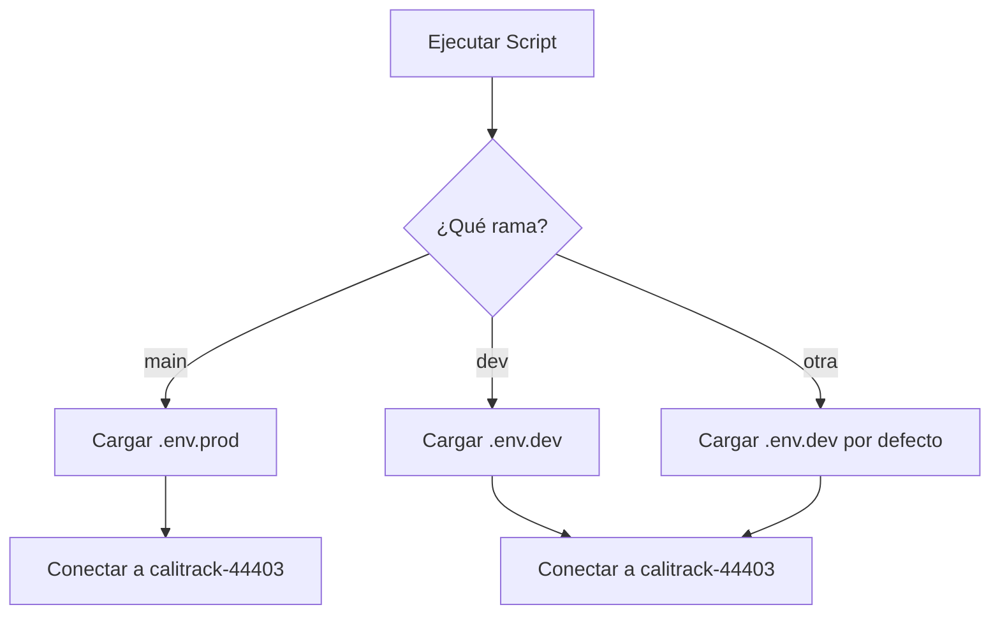

# 🔧 Configuración de Múltiples Entornos

Este documento explica cómo está configurado el sistema para trabajar con múltiples entornos de Firebase de manera segura y aislada.

## 📋 Índice

1. [Descripción General](#descripción-general)
2. [Arquitectura de Entornos](#arquitectura-de-entornos)
3. [Configuración Inicial](#configuración-inicial)
4. [Uso Diario](#uso-diario)
5. [Seguridad](#seguridad)
6. [Troubleshooting](#troubleshooting)

---

## Descripción General

El proyecto ahora soporta múltiples entornos Firebase para permitir desarrollo y pruebas sin afectar los datos de producción:

- **Rama `main`**: Producción → `calitrack-44403`
- **Rama `dev`**: Desarrollo → `calitrack-44403`

### ✨ Características

- ✅ Detección automática de entorno basada en la rama Git
- ✅ Configuraciones separadas por entorno (`.env.dev`, `.env.prod`)
- ✅ Protección de credenciales (archivos `.env` en `.gitignore`)
- ✅ Cambio de entorno transparente al cambiar de rama

---

## Arquitectura de Entornos

### 🏗️ Estructura de Archivos

```
proyectos_cali_alcaldia_etl/
├── .env.dev              # Configuración de desarrollo (NO commiteado)
├── .env.prod             # Configuración de producción (NO commiteado)
├── .env.example          # Plantilla para nuevos desarrolladores
├── database/
│   └── config.py         # Detección automática de entorno
└── docs/
    └── multi-environment-setup.md  # Este documento
```

### 🔀 Flujo de Detección de Entorno



---

## Configuración Inicial

### 1️⃣ Clonar y Configurar el Repositorio

```bash
# Clonar el repositorio
git clone https://github.com/Juanpgm/proyectos_cali_alcaldia_etl.git
cd proyectos_cali_alcaldia_etl

# Ver ramas disponibles
git branch -a
```

### 2️⃣ Crear Archivos de Configuración

#### Para Desarrollo (Rama `dev`)

```bash
# Cambiar a rama dev
git checkout dev

# Copiar la plantilla
cp .env.example .env.dev

# Editar .env.dev
nano .env.dev  # o usar tu editor favorito
```

Configurar las siguientes variables en `.env.dev`:

```bash
# Firebase - DESARROLLO
FIREBASE_PROJECT_ID=calitrack-44403
GOOGLE_CLOUD_PROJECT=calitrack-44403

# Configuración de Firestore
FIRESTORE_BATCH_SIZE=500
FIRESTORE_TIMEOUT=30

# Google Sheets
SHEETS_SERVICE_ACCOUNT_FILE=./sheets-service-account.json
SHEETS_UNIDADES_PROYECTO_URL=https://docs.google.com/spreadsheets/d/YOUR_SHEET_ID/edit
SHEETS_UNIDADES_PROYECTO_WORKSHEET=obras_equipamientos

# GitHub (opcional para workflows)
GITHUB_TOKEN=your_token_here
GITHUB_OWNER=Juanpgm
GITHUB_REPO=proyectos_cali_alcaldia_etl

# Identificador de ambiente
ENVIRONMENT=development
```

#### Para Producción (Rama `main`)

```bash
# Cambiar a rama main
git checkout main

# Copiar la plantilla
cp .env.example .env.prod

# Editar .env.prod
nano .env.prod
```

Configurar las siguientes variables en `.env.prod`:

```bash
# Firebase - PRODUCCIÓN
FIREBASE_PROJECT_ID=calitrack-44403
GOOGLE_CLOUD_PROJECT=calitrack-44403

# ... (resto de configuraciones)

# Identificador de ambiente
ENVIRONMENT=production
```

### 3️⃣ Configurar Autenticación de Firebase

Para cada proyecto de Firebase, necesitas configurar las credenciales:

```bash
# Para desarrollo (calitrack-44403)
gcloud auth application-default login --project=calitrack-44403

# Para producción (calitrack-44403)
gcloud auth application-default login --project=calitrack-44403
```

**Nota**: Las credenciales de Application Default se almacenan globalmente. El sistema usará las credenciales del proyecto configurado en el archivo `.env` correspondiente.

### 4️⃣ Verificar Configuración

```bash
# En rama dev
git checkout dev
python -m database.config

# Deberías ver:
# 🔧 Usando configuración de DESARROLLO (.env.dev)
# ✅ Variables de entorno cargadas desde .env.dev
# 🔧 Proyecto: calitrack***
```

```bash
# En rama main
git checkout main
python -m database.config

# Deberías ver:
# 🔧 Usando configuración de PRODUCCIÓN (.env.prod)
# ✅ Variables de entorno cargadas desde .env.prod
# 🔧 Proyecto: dev-test***
```

---

## Uso Diario

### 🔄 Cambiar Entre Entornos

El cambio de entorno es **automático** al cambiar de rama:

```bash
# Trabajar en desarrollo
git checkout dev
# Automáticamente usará calitrack-44403

# Ejecutar pipelines en desarrollo
python pipelines/unidades_proyecto_pipeline.py
```

```bash
# Trabajar en producción
git checkout main
# Automáticamente usará calitrack-44403

# Ejecutar pipelines en producción (¡con cuidado!)
python pipelines/unidades_proyecto_pipeline.py
```

### 🧪 Flujo de Trabajo Recomendado

1. **Desarrollo y Pruebas**

   ```bash
   git checkout dev
   # Hacer cambios y pruebas en calitrack-44403
   # Los datos de producción están protegidos
   ```

2. **Testing**

   ```bash
   # Ejecutar tests locales
   pytest

   # Verificar comportamiento
   python pipelines/unidades_proyecto_pipeline.py
   ```

3. **Deploy a Producción**

   ```bash
   # Cuando todo funcione correctamente
   git checkout main
   git merge dev

   # Ejecutar en producción
   python pipelines/unidades_proyecto_pipeline.py
   ```

### 📝 Commits y Push

```bash
# En rama dev
git checkout dev
git add .
git commit -m "feat: nueva funcionalidad probada en dev"
git push origin dev

# Cuando esté listo para producción
git checkout main
git merge dev
git push origin main
```

---

## Seguridad

### 🔒 Protección de Credenciales

Los archivos `.env.dev` y `.env.prod` están en `.gitignore` y **NUNCA** deben commitearse:

```gitignore
# Environment variables
.env
.env.dev
.env.prod
.env.local
.env.development.local
.env.test.local
.env.production.local
```

### 🚨 Verificación Antes de Commit

Antes de hacer commit, verifica que no estés incluyendo archivos sensibles:

```bash
# Ver archivos que se van a commitear
git status

# Si ves .env.dev o .env.prod, NO hagas commit
# Agrega el archivo a .gitignore si no está
```

### 🔑 Compartir Configuración con el Equipo

**NUNCA** compartas credenciales por Git. En su lugar:

1. Comparte el archivo `.env.example` (sin credenciales reales)
2. Usa un gestor de contraseñas seguro (1Password, LastPass, etc.)
3. O usa servicios de gestión de secretos (Google Secret Manager, AWS Secrets Manager)

```bash
# Los nuevos miembros del equipo deben:
cp .env.example .env.dev
# Y luego obtener las credenciales de manera segura
```

---

## Troubleshooting

### ❌ Error: "No se encontró archivo de configuración"

**Problema**: El sistema no encuentra el archivo `.env.dev` o `.env.prod`

**Solución**:

```bash
# Verificar que estés en la rama correcta
git branch

# Verificar que el archivo existe
ls -la .env.*

# Si no existe, crearlo desde la plantilla
cp .env.example .env.dev  # o .env.prod
```

### ❌ Error: "Conexión a Firebase fallida"

**Problema**: No puedes conectarte a Firebase

**Solución**:

```bash
# Re-autenticar con gcloud
gcloud auth application-default login --project=calitrack-44403

# Verificar credenciales
gcloud auth application-default print-access-token

# Verificar que el PROJECT_ID es correcto
grep FIREBASE_PROJECT_ID .env.dev
```

### ❌ Error: "Escribiendo en el proyecto incorrecto"

**Problema**: Los datos se están guardando en el proyecto equivocado

**Verificación**:

```bash
# 1. Verificar rama actual
git branch

# 2. Verificar archivo .env usado
python -c "from database.config import PROJECT_ID; print(f'Proyecto: {PROJECT_ID}')"

# 3. Verificar contenido del archivo
cat .env.dev  # o .env.prod
```

### ❌ "El sistema está usando el archivo .env incorrecto"

**Problema**: El sistema carga `.env` genérico en lugar de `.env.dev`/`.env.prod`

**Solución**:

```bash
# Renombrar .env a .env.backup
mv .env .env.backup

# Ahora el sistema usará .env.dev o .env.prod
```

### 🔍 Verificar Configuración Actual

Ejecuta este comando para ver la configuración activa:

```bash
python -m database.config
```

Salida esperada:

```
🔧 Usando configuración de DESARROLLO (.env.dev)
✅ Variables de entorno cargadas desde .env.dev
💻 OS: Windows 10
🐍 Python: 3.11.5
📁 Directorio: .../proyectos_cali_alcaldia_etl
🔧 Project ID: calitrack***
🚀 Configurando Firebase...
🔧 Proyecto: calitrack***
⚙️  Batch size: 500
⏱️  Timeout: 30s
```

---

## 📚 Referencias

- [Firebase Application Default Credentials](https://firebase.google.com/docs/admin/setup#initialize_the_sdk_in_non-google_environments)
- [Google Cloud Project Management](https://cloud.google.com/resource-manager/docs/creating-managing-projects)
- [Git Branch Strategy](https://www.atlassian.com/git/tutorials/comparing-workflows/gitflow-workflow)

---

## 🆘 Soporte

Si tienes problemas con la configuración:

1. Revisa este documento completo
2. Ejecuta `python -m database.config` para diagnóstico
3. Verifica los logs en la carpeta `logs/`
4. Contacta al equipo de desarrollo

---

**Última actualización**: Noviembre 8, 2025
**Versión**: 1.0
**Autor**: Juan Pablo Guzmán
